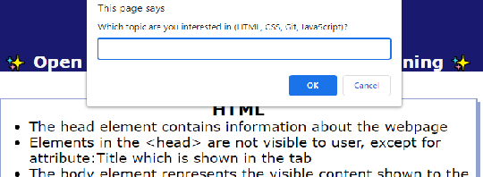
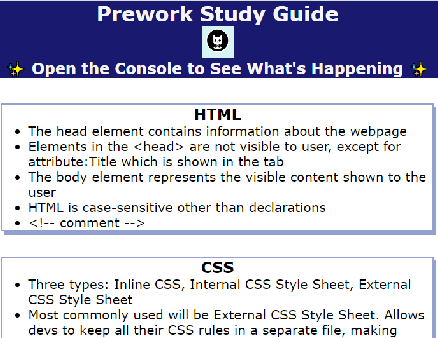
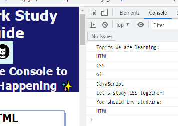

# Prework Study Guide Webpage

## Description

This is a website with notes on the topics we have learned in our [Precourse Work](https://courses.bootcampspot.com/courses/3172) for the Coding Boot Camp! 
Topics include: HTML, CSS, Git, and JavaScript

This was made as a quick reference point for notes that have been accumulated throughout the precourse modules. Creating a summary of important points one may need to quickly refer to rather than going through all the pages and videos in the module. 

Following the coursework, we've learned some of the basics of webdevelopment, as shown by the live webpage. 
The formatting and text was done via HTML, styling was done using an External CSS Style Sheet, while JavaScript was included to interact with the console. These were done while continually linking back to GitHub using the Git Flow.  

## Usage

Upon landing on the webpage, you'll be prompted to answer "Which topic are you interested in?" after entring your answer or cancelling out of the prompt.

You'll be able to see the topic notes. 

If you'd like to interact with the console: Ctrl+Shift+I (windows), Command+Option+I (mac), Left-click>Inspect -to access Chrome DevTools. 
The topics we have learned will be listed. The prompt at the beginning will change line 6, excited to sutdy the topic chosen together (or asking to try again as topic chosen wasn't on the list). Line 8 is a randomly generated topic chosen from the list (this may be duplicative if it randomly generates CSS and you've chosen to study CSS. So I would like to see if I can have it not stack in the future.) 

## Credits

Coding [Boot Camp](https://courses.bootcampspot.com)

[Google](https://www.google.ca/)

## License

Licensed under the MIT license.
